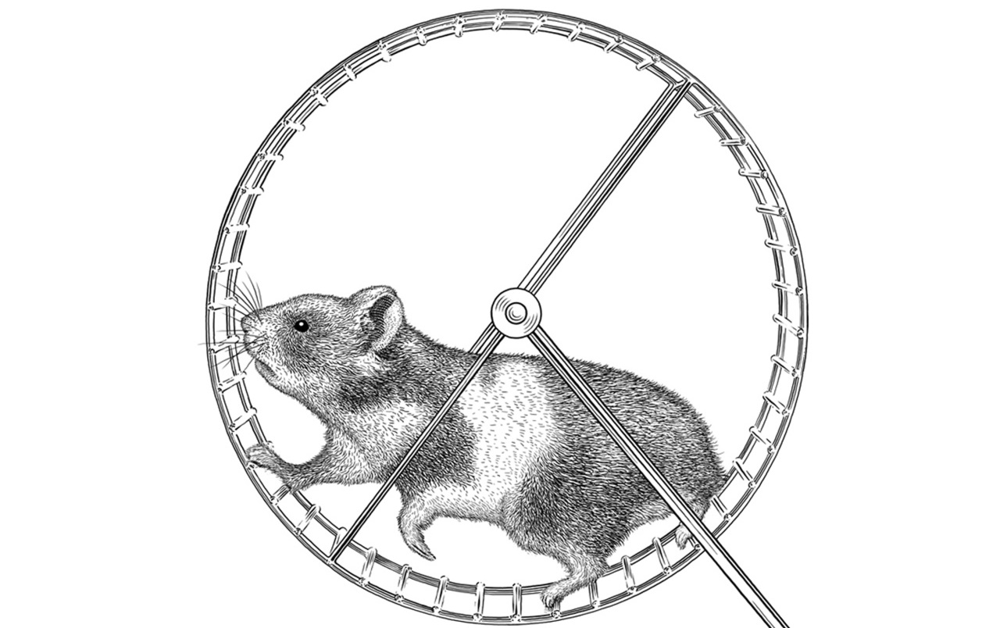

This project writeup was originally posted on Medium in 2018.
The state of GPGPU-Sim [has changed significantly since then](https://github.com/gpgpu-sim/gpgpu-sim_distribution/issues/47#issuecomment-528697184).
To reflect this, the writeup below has been modified from [the original one on Medium](https://medium.com/@jlperona/gpgpu-sim-and-machine-learning-workloads-152563e6703f).

You can find the Dockerfiles on GitHub at [jlperona/gpgpu-sim-dockerfiles](https://github.com/jlperona/gpgpu-sim-dockerfiles).
You can also find the containers that they build on [Docker Hub](https://hub.docker.com/u/jlperona/).

## Background

During the course of my Master's degree, I took EEC 289Q (Modern Parallel Computing) with [Professor John Owens](https://www.ece.ucdavis.edu/~jowens/home.html).
My choice for the final project for that class was to try to get a machine learning workload running on [GPGPU-Sim](https://github.com/gpgpu-sim/gpgpu-sim_distribution), a cycle-level GPU simulator that can run CUDA and OpenCL workloads.
Little did I know that I would be subjecting myself to one of the worst hells imaginable—_dependency hell_.

### Praise to be Docker

GPGPU-Sim (in early 2018) built with a maximum of GCC 4.6.
I tried to build with later versions of GCC, and it unfortunately wouldn't compile.
Nor did I have GCC 4.6 in my installation of Ubuntu 17.10.
Building older versions of GCC from source is a huge pain, and I wanted to avoid that if possible.

This is where Docker comes in and saves the day.
Thanks to a [Docker container](https://hub.docker.com/r/powerjg/gpgpu-sim-build/) provided by the professor that I was working with, I was able to build [GPGPU-Sim’s dev branch](https://github.com/gpgpu-sim/gpgpu-sim_distribution/tree/dev).
I wouldn’t have been able to get as far as I did if it weren’t for Docker.

That Docker container contains all the dependencies needed to build the dev branch of GPGPU-Sim, _with one exception_: you need to delete lines 552–577 of libcuda/cuda_runtime_api.cc.
This deletes any reference to cudaMemcpyDefault(), which isn’t in the version of CUDA installed in the container.

Spurious hack aside, if you wanted to start working with GPGPU-Sim in 2018, that would have been a good place to do so.
However, it uses CUDA 3.2.16 and Ubuntu 12.04, which are both very outdated.
This issue will come up again later.

### Machine Learning Frameworks

Running ML workloads on GPGPU-Sim is desirable, if the activity on [this issue in GPGPU-Sim’s GitHub repository](https://github.com/gpgpu-sim/gpgpu-sim_distribution/issues/47) is to be believed.
The professor I was working with wanted some topical workloads to run for an upcoming paper submission.
The explosion in popularity of ML in recent years meant that having data from an ML workload would be great for the paper.

One unfortunate requirement for GPGPU-Sim (back in 2018) is that the workloads that you try to run on it cannot provide binaries with GPU machine code.
This is because GPGPU-Sim runs off of the program’s PTX.
This becomes a huge problem when trying to run ML workloads.
Most ML frameworks (including the biggest ones at the time, [Caffe](http://caffe.berkeleyvision.org/) and [TensorFlow](https://www.tensorflow.org/)) use [cuDNN](https://developer.nvidia.com/cudnn).
[According to one of the developers of GPGPU-Sim](https://github.com/gpgpu-sim/gpgpu-sim_distribution/issues/47#issuecomment-341544755), this means that they won’t work with GPGPU-Sim, since cuDNN provides binaries.
(Note that this is [no longer the case](https://github.com/gpgpu-sim/gpgpu-sim_distribution/issues/47#issuecomment-528697184) as of 2019.)

At the time, if I wanted to get a ML framework to run, I would need to find one that didn't use cuDNN or cuBLAS.
That was surprisingly difficult.
When I looked at [NVIDIA’s Deep Learning Frameworks page](https://developer.nvidia.com/deep-learning-frameworks) in 2018, nearly every single one used cuDNN.
I did end up finding two that met my needs, though.
I’m sure there were others, but these are the ones I tried to work with.

#### Kaldi

[Kaldi](https://kaldi-asr.org/doc/about.html) is a C++ speech recognition toolkit.
However, it also has [a couple implementations of deep neural networks](http://kaldi-asr.org/doc/dnn.html).
Kaldi doesn’t use cuDNN, so it meets my needs.

I tried to get their [example using CIFAR](https://github.com/kaldi-asr/kaldi/tree/master/egs/cifar) working.
This is a good place to start.
The documentation for Kaldi’s neural networks suggests using **wsj** as a starting point, but I had problems building that one.

#### neon

[neon](https://github.com/NervanaSystems/neon) is a deep learning framework.
Originally developed by Nervana Systems, they were bought out by Intel, and Intel supported neon until 2019.
neon also doesn’t use cuDNN, so it met my needs there.
However, it uses Python, and at the time I was unsure if GPGPU-Sim would play nice with Python workloads.
(Note that this is [no longer the case](https://github.com/gpgpu-sim/gpgpu-sim_distribution/issues/47#issuecomment-528697184) as of 2019.)

neon has a bunch of examples [included in their repository](https://github.com/NervanaSystems/neon/tree/master/examples).
I tried the one listed on their installation documentation, which no longer exists.

## Methodology

I found a couple ML workloads that seemed promising, now I needed to get them to work.
Easier said than done.
I mentioned _dependency hell_ before—this is that hell.

### Pannotia

My benchmark to see if I was getting GPGPU-Sim to run at all was [Pannotia](https://www.cs.virginia.edu/~skadron/Papers/Che-pannotia-iiswc2013.pdf).
The professor I was working with was using Pannotia for the paper, so I knew that this worked.
I provide instructions on how test and make sure that the Pagerank benchmark in Pannotia is working in the [README of my GitHub repository](https://github.com/jlperona/gpgpu-sim-dockerfiles/blob/master/README.md).

### Ubuntu 12.04 and Python

The Docker container I was provided uses Ubuntu 12.04.
One of neon’s dependencies is [pip](https://pip.pypa.io/en/stable/), so I tried to install it.
No go, either from apt or from source.
The versions of Python you can get with Ubuntu 12.04 were too old.

I decided to update the Ubuntu version to 14.04.
You can find [that Dockerfile on GitHub](https://github.com/jlperona/gpgpu-sim-dockerfiles/blob/master/dockerfiles/ubuntu1404.dockerfile), and [its corresponding container on Docker Hub](https://hub.docker.com/r/jlperona/gpgpu-sim-build/).
This allowed me to get a later version of Python, and I was able to successfully install pip.

### Problems with neon

After installing all of neon’s dependencies, and the dependencies for [aeon](https://github.com/NervanaSystems/aeon), its data loader, I managed to successfully build neon.
Unfortunately, whenever I tried to run its examples using the CPU backends, aeon would refuse to load any of the data sets.
It turns out I would keep encountering errors building wheels for a couple of aeon’s dependencies.
I couldn’t figure out why this was a problem, but my guess is that it was because I was using an older version of Python on Ubuntu 14.04.

### Problems with Kaldi

After encountering that problem with neon, I decided to try Kaldi.
It was a good thing I updated to Ubuntu 14.04, as Kaldi supports a minimum GCC version of 4.7, which isn’t available in apt on 12.04.
14.04 has both 4.6 and a later version available in apt, so I installed both.

After installing Kaldi’s dependencies, it helpfully let me know that the version of CUDA I had installed was too low.
Okay, let’s get a more recent version of CUDA.
The first version of CUDA that NVIDIA officially supported Ubuntu 14.04 in was [CUDA 6.5](https://developer.nvidia.com/cuda-toolkit-65), so I used that one.
You could potentially use other versions of CUDA, but [you’re limited by the versions of GCC that CUDA supports](https://stackoverflow.com/questions/6622454/cuda-incompatible-with-my-gcc-version/6622751#6622751).

In any case, I tried to install a later version of CUDA, but that failed.
While it installed, I couldn’t redirect the CUDA library calls to GPGPU-Sim when testing Pannotia.
I couldn’t figure out why this was the case, and that is where I stopped.

### My Dockerfiles

Instead of deleting everything, I decided to make my Dockerfiles and containers available so that somebody else has a starting point if they want to make this work.

[ubuntu1404.dockerfile](https://github.com/jlperona/gpgpu-sim-dockerfiles/blob/master/dockerfiles/ubuntu1404.dockerfile) and [jlperona/gpgpu-sim-build](https://hub.docker.com/r/jlperona/gpgpu-sim-build/) works.
You can build the dev branch of GPGPU-Sim and have workloads run correctly.

[cuda6514.dockerfile](https://github.com/jlperona/gpgpu-sim-dockerfiles/blob/master/dockerfiles/cuda6514.dockerfile) and [jlperona/gpgpu-sim-build-update](https://hub.docker.com/r/jlperona/gpgpu-sim-build-update/) don’t work as is.
You can build the dev branch of GPGPU-Sim, but CUDA calls will go to the system installation of CUDA.
Work needs to be done so that GPGPU-Sim actually runs when you run a CUDA workload.

Note that as of 2021, there are Dockerfiles and Docker containers that claim to support GPGPU-Sim out of the box now.
I haven't tested these, but I would start with those rather than these ones.

## Conclusions

Trying to get this to work was a frustrating experience.
I didn’t end up getting anything working in the end.
However, two good things came out of this experience:

- This post, so that the next person who tries to do this may have some background material.
- The [Dockerfiles](https://github.com/jlperona/gpgpu-sim-dockerfiles/tree/master/dockerfiles) and [Docker containers](https://hub.docker.com/u/jlperona/) that I’ve hosted on GitHub and Docker Hub, respectively.

My hope is that somebody who’s searching for this exact issue in the future finds this post and can use my past experiences to save them some time and frustration.
Let’s make this the opposite of [Wisdom of the Ancients](https://xkcd.com/979/).

I have a feeling it’s still going to be this, though:

## Attribution

Teaser image and image above courtesy of [@ThePracticalDev](https://twitter.com/ThePracticalDev).
Image licensed under [CC BY-NC 2.0](https://creativecommons.org/licenses/by-nc/2.0/).
